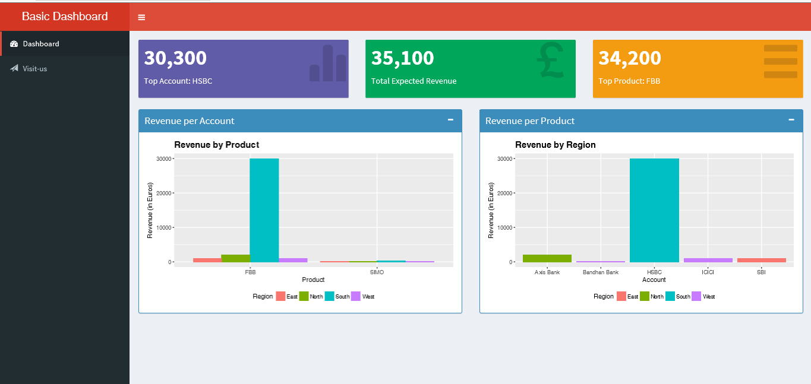

# Simple (Web App) Dashboard Shiny
Code and Plots used in the related article

Screenshot #1:

### Running the app

* Install the required packages `install.packages(c('shiny','shinydashboard','ggplot2','dplyr'))`
* Run `shiny::runGitHub("amrrs/sample_revenue_dashboard_shiny")`
